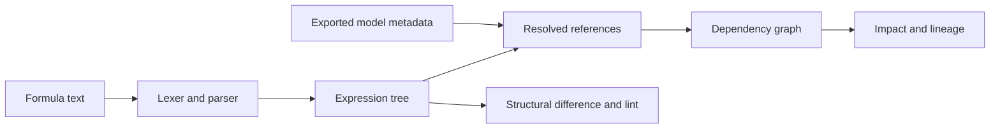

# Engineering walkthrough: an Anaplan formula parser

**Author:** Karim Lameer, CIMA-qualified accountant and Master Anaplanner.
This is the parsing and analysis foundation for
[Anaplan Estate](https://github.com/klameer/anaplan-estate).

## Problem and implementation

Formula text is difficult to analyse with name matching alone. Names can
contain punctuation, spaces and words that also act as keywords; identical
line-item names can exist in different modules. Understanding change impact
requires references resolved in their formula and model context.

I developed a grammar, lexer and recursive-descent parser, then added model
loading, dependency queries, structural differences, lint rules and reports.
The core has no third-party runtime dependencies. Parsed expressions are
plain dictionaries, so they can be inspected and serialised to JSON.



## Read the code in this order

| File | Decision to inspect |
| --- | --- |
| [Grammar](grammar/anaplan.ebnf) | Syntax rules and their documentation sources. |
| [Lexer](src/anaplan_grammar/lexer.py) | How quoted names and keyword-looking names are tokenised. |
| [Parser](src/anaplan_grammar/parser.py) | Precedence, IF ambiguity and the expression-tree representation. |
| [Graph](src/anaplan_grammar/graph.py) | Reference resolution and upstream/downstream queries. |
| [Difference engine](src/anaplan_grammar/diff.py) | Formula structure, rename candidates and downstream impact. |
| [Regression tests](tests/test_grammar.py) | Fictional syntax cases, expected references, precedence and round trips. |

## Reproduce a small example

From a checkout, using Python 3.10 or later:

```bash
python -m pip install -e ".[dev]"
anaplan-grammar parse "'Costs'.Salary[SUM: 'Staff'.Region]" --refs
anaplan-grammar stats tests/fixtures/caldergate_line_items.csv
python -m pytest tests -q
```

## Validation and boundaries

The reported 13,214/13,214 parse and round-trip result comes from a private
development corpus of ten models across three organisations. Those formulas
are not distributed. The public fictional cases let reviewers inspect the
behaviour, but do not independently reproduce the full private corpus result.

Round-trip consistency does not prove semantic correctness. Reference
checks and comparison with Anaplan's Referenced By column provide additional
evidence; they also expose missing inputs such as line-item-subset membership
for COLLECT. The [corpus notes](corpus/README.md) record the measurements and
residuals. Unseen-model validation is still needed.

This is syntax and structural analysis. It does not evaluate an Anaplan
model, infer all dimensional types, prove business correctness or establish
that an unreferenced item has no external consumer.

## Trade-offs to discuss

- A small inspectable parser versus the maintenance cost of supporting a
  language whose production edge cases must be discovered.
- Structural comparison versus text comparison, and the uncertainty in
  matching renamed objects without stable IDs.
- Reporting incomplete coverage explicitly versus presenting a graph as complete.
- Keeping the parser reusable while allowing richer reports in a separate tool.
